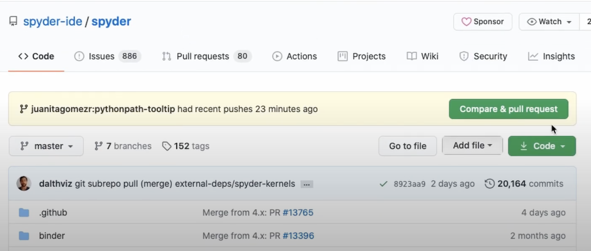

# Contributing to Spyder

This section will help you to set up an environment for contributing to Spyder as well as creating third party Spyder Plugins.


## First contribution

If this is your first time contributing to Spyder or in general to open source we invite you to watch the video below which will guide you with the main steps with doing your first contribution.

<figure class="video_container">
  <iframe src="https://www.youtube.com/embed/GizipMT1LvQ" frameborder="0" allowfullscreen="true" width="640" height="390"> </iframe>
</figure>

For a detailed explanation, follow the instructions below.


### Clone and Fork the repository

The first thing you need to do fork Spyder's repository. To do this, log into your account on GitHub and click the “Fork” button at the top left of the project's page. This will create a copy of the repository in your own account.


Then, click the ``Clone or Download`` button on your repository and copy the link.


After that, run the following on the command line (or Git Bash, if you’ve installed Git for Windows) to clone the repo:

```bash
git clone <LINK-TO-YOUR-REPO>
```

Set the upstream remote to the official Spyder repo with:

```bash
git remote add upstream https://github.com/spyder-ide/spyder.git
```

This will allow you to keep your local repo up to date with the latest changes in Spyder.

For a beginner guide on using Git, check the link below:

[https://rogerdudler.github.io/git-guide](https://rogerdudler.github.io/git-guide)


### Create a conda environment or virtualenv

If you use Anaconda you can create a conda environment with the following commands:

```bash
conda create -n spyder-dev python=3
conda activate spyder-dev
```

You can also use `virtualenv` on Linux, but `conda` is **strongly** recommended:

```bash
mkvirtualenv spyder-dev
workon spyder-dev
```


### Installing dependencies

After you have created your development environment, you need to install Spyder's necessary dependencies. The easiest way to do so (with Anaconda) is

```bash
conda install -c spyder-ide/label/dev --file requirements/conda.txt
```

This installs all Spyder's dependencies into the environment.
If you are running on macOS, you will also need to install `python.app`.

```bash
conda install python.app
```

If using `pip` and `virtualenv` (not recommended), you need to `cd` to the directory where your git clone is stored and run:

```bash
pip install -e .
```


### Running Spyder

To start Spyder directly from your clone, i.e. without installing it into your environment, you need to run (from the directory you cloned it to e.g. `spyder`):

```bash
python bootstrap.py
```

Note that if you are running on macOS, you will need to call `pythonw` instead of `python`.

To start Spyder in debug mode, useful for tracking down an issue, you can run:

```bash
python bootstrap.py --debug
```


### Commit your changes

Once you make your changes to the repository,
you have to create a branch for your work.

**NOTE**
If your change is small, like a bug fix or minor UI improvement, you should make it to the branch for the current version of Spyder, in this case “5.x”, instead of master. You need to base your new branch on the correct Spyder branch in order to avoid conflicts.

Here, we will explain how to do it with 5.x.

Run:

```bash
git checkout 5.x
```

Make sure to reset the Spyder configuration file when switching between master and 5.x by running:

```bash
python bootstrap.py -- --reset
```

Next, create your branch from this one. Remember to give your branch a name that is related to your fix. For this, run the following command:

```bash
git checkout -b [BRANCH-NAME]
```

Add and commit your changes with a descriptive message.

```bash
git commit -a -m “[MESSAGE]”
```

Finally, push your new branch with your changes to your fork on GitHub:

```bash
git push -u origin pythonpath-tooltip
```

Enter your GitHub username and password if requested.


### Opening a PR

Now, you can submit your changes to Spyder’s repo.

Go to the Spyder repository on GitHub, and you will see the option to open a Pull Request. Before submitting it, make sure that you read the template.



Make sure that you select the correct branch to merge your changes.


## Other ways to contribute

If you don't feel comfortable with starting with a code contribution, there are other ways in which you can help. Here are some of them:


### Issue testing and triaging

Go to our [issue tracker](https://github.com/spyder-ide/spyder/issues) and do one of the following:

* Check if older bugs are still present
* Find duplicate issues and link related ones
* Label issues correctly


### Reviewing PRs

Visit our [Pull Requests](https://github.com/spyder-ide/spyder/pulls) and:

* Test the changes proposed in the PR
* Review the style and content of the PR


### Translations: Crowdin

We welcome your help translating Spyder's interface into different languages. For this purpose we use [Crowdin](https://crowdin.com/project/spyder), which provides a simple web based interface for translators, proofreaders and managers, so everyone can help us translate Spyder into any language.


### Improving documentation

We also have a [docs repository](https://github.com/spyder-ide/spyder-docs) to which you can also contribute in several ways:

* Read tutorials and report confusing parts or missing parts.
* Finding type-os or minor errors and report them as issues.
* Write your own content if you see something missing.


### Participating in the community

We invite you to be an active member of our community by:

* Following our social media
* Sharing relevant content
* Participating in discussions
