.. _tutorial-main:

###################################
Tutorial to develop a Spyder plugin
###################################

This tutorial walks you through creating a Spyder plugin to add a configurable `Pomodoro Technique`_ timer to the status bar and toolbar buttons to interact with it.
Along the way, we'll learn how to use Spyder's API to develop plugins and extend their functionality.

To do so, we'll:

#. List the :ref:`tutorial-prereqs` to implement a Spyder plugin.
#. Describe the :ref:`tutorial-goals` that a participant can achieve.
#. Explain the :ref:`types of Spyder plugins <tutorial-plugin-concepts>` and their benefits.
#. Define how to :ref:`set up an environment <tutorial-setup>` for plugin development.
#. Go through the :ref:`steps <tutorial-building-plugin>` to build and publish a simple plugin.
#. Finally, highlight the key points of developing maintainable, adaptable plugins with Spyder.

.. _website: https://www.spyder-ide.org

.. _tutorial-prereqs:

=============
Prerequisites
=============

You will need to have Spyder 5 installed.
Visit our :ref:`spyder:install-guide` for more information.

.. important::

   Spyder offers :ref:`spyder:install-standalone` for Windows, macOS and Linux, making it easier to get up and running with the application without having to download Anaconda or manually install it in your existing environment.
   However, for this tutorial Spyder should be installed using Anaconda or Miniconda, as standalone installers currently do not allow adding extra packages like the plugin we are going to develop.

It is also desirable to have the following prior knowledge:

* Intermediate proficiency with Python.
  You can visit `The Python Tutorial`_ to learn the basics of this programming language.
* Basics of Qt application development using Python, either with `PyQt`_ or `PySide`_.

To quickly get started in desktop application development with Qt and Python, here is a set of open access resources:

* `Real Python - PyQt entries`_
* `Guru99 - PyQt tutorial`_
* `Python GUIs - PyQt and PySide tutorials`_

.. _The Python Tutorial: https://docs.python.org/3/tutorial/
.. _PyQt: https://www.riverbankcomputing.com/static/Docs/PyQt5/
.. _PySide: https://doc.qt.io/qtforpython-5/index.html
.. _Tutorials Point - PyQt tutorial: https://www.tutorialspoint.com/pyqt/index.htm
.. _Real Python - PyQt entries: https://realpython.com/search?q=pyqt
.. _Guru99 - PyQt tutorial: https://www.guru99.com/pyqt-tutorial.html
.. _Python GUIs - PyQt and PySide tutorials: https://www.pythonguis.com/

.. _tutorial-goals:

==============
Learning goals
==============

By the end of this tutorial, we'll learn:

* The basics of developing plugins for Spyder, and a general idea of its inner workings.
* The :ref:`types of plugins <tutorial-plugin-types>` that can be developed for Spyder.
* The :ref:`structure of a plugin <tutorial-structure-details>`, the :ref:`functionality <tutorial-plugin-features>` of its components, and how to extend its features.
* The way to package and publish a plugin so that it can be installed and used by others.

.. _tutorial-spyder-fundamentals:

===================
Spyder fundamentals
===================

Before we dive into the formal explanation of Spyder plugins, let's briefly go over some Spyder basics.
Spyder is a powerful scientific desktop application written in Python with features for data exploration, interactive execution, deep inspection, and graphical visualization.
Spyder uses Qt for its GUI, through the PyQt or PySide Python bindings via the `QtPy`_ abstraction layer:

* `Qt`_ is an open source, multiplatform toolkit for creating graphical user interfaces.
  It is a complete development framework that offers utilities for building applications and has extensions for networking, Bluetooth, charts, 3D rendering, and navigation, among others.

* PyQt and PySide are two different Python bindings for the C++-native Qt library, allowing Spyder to use Qt from Python.
* `QtPy`_ is an abstraction layer for PyQt and PySide, allowing Spyder to work with either one as well as multiple major Qt versions.

As for Spyder's own structure, all of its panes and nearly all its functionality is implemented as plugins.
This means the plugins you create can be just as powerful as Spyder's own internal components!

To learn more about Spyder itself, check out the `website`_ and `documentation`_, and to contribute, read the `contributing guide`_!

.. _documentation: https://docs.spyder-ide.org
.. _contributing guide: https://github.com/spyder-ide/spyder/blob/master/CONTRIBUTING.md
.. _Qt: https://www.qt.io/
.. _QtPy: https://github.com/spyder-ide/qtpy

.. _tutorial-plugin-concepts:

=====================
Basic plugin concepts
=====================

Now that we know a little bit about the basics of Spyder, let's go over the basics of Spyder plugins.

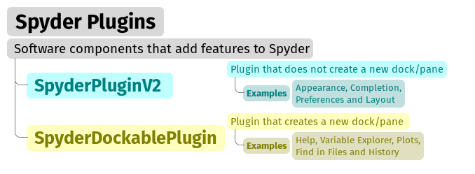

First, let's define what a plugin is.
A *plugin* is a component that adds functionality to an application; it can be a graphical component, for example, to display maps, or a non-graphical one that adds additional syntax highlighting schemes.
For Spyder, plugins add new panes, new features, or otherwise modify Spyder's behavior.
Aside from a few fundamental components, most of Spyder's functionality is implemented via plugins of two types: ``SpyderDockablePlugin`` and ``SpyderPluginV2``.

.. _tutorial-plugin-types:
.. _tutorial-spyderdockableplugin:

SpyderDockablePlugin
~~~~~~~~~~~~~~~~~~~~

A plugin with a dockable pane in the Spyder interface, implemented as a `QDockWidget`_.
This is a Qt class that provides a graphical widget that can be docked inside a `QMainWindow`_ or floated as a top-level window on the desktop.

.. topic:: ``SpyderDockablePlugin``

   If we look at the Spyder interface, we can find a number of different panes (on the right side, with the default layout), such as :guilabel:`Help`, :guilabel:`Variable Explorer`, :guilabel:`Plots`, :guilabel:`Files` and :guilabel:`History`:

   * Each of these panes is a ``SpyderDockablePlugin`` that offers an :guilabel:`Undock` option by clicking the hamburger menu button in the upper right corner.

   * These plugins can also be hidden or shown via their entry in the :menuselection:`View --> Panes` menu, or using their corresponding keyboard shortcut displayed there.

.. _QDockWidget: https://doc.qt.io/archives/qtforpython-5.12/PySide2/QtWidgets/QDockWidget.html
.. _QMainWindow: https://doc.qt.io/archives/qtforpython-5.12/PySide2/QtWidgets/QMainWindow.html

.. _tutorial-spyderpluginv2:

SpyderPluginV2
~~~~~~~~~~~~~~

A plugin that does not create a new pane (``QDockWidget``) in Spyder's main window.
In fact, ``SpyderPluginV2`` is the parent class of ``SpyderDockablePlugin``.

.. topic:: ``SpyderPluginV2``

   High-level interface elements that do not offer an undocking option are typically instances of ``SpyderPluginV2``.
   These are typically used to handle more abstract functionality:

   * Examples include the *appearance* and *layout* plugins that manage Spyder's syntax highlighting schemes and window layouts respectively.

   * Other examples of this type of plugins are the *main menu* and keyboard *shortcuts*.
   * Some graphical elements, such as the main toolbar and the status bar, are also instances of the ``SpyderPluginV2`` class.

.. _tutorial-task-overview:

================
What will we do?
================

So far, we have :ref:`reviewed the concepts <tutorial-plugin-concepts>` necessary to create your first plugin.
In this section, we:

#. :ref:`Explain the Pomodoro technique <tutorial-pomodoro-technique>` that will be implemented for time management in the plugin.
#. Describe the :ref:`steps to develop the plugin <tutorial-plugin-steps>`.
#. :ref:`Present the main features <tutorial-plugin-features>` that will be displayed in Spyder once the plugin is developed and published.

.. _tutorial-pomodoro-technique:

Pomodoro Technique
~~~~~~~~~~~~~~~~~~

The `Pomodoro Technique`_, designed by Francesco Cirillo, is a time management practice used to increase concentration and productivity when completing tasks or meeting deadlines.
Using a Pomodoro timer can help you pay attention to a task.

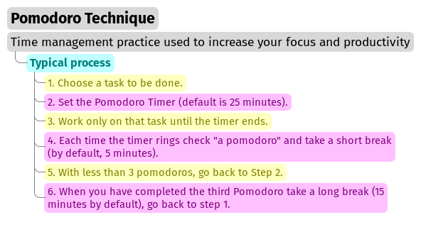

The typical process of the Pomodoro technique consists of the following six steps:

1. Choose a task to be done.
2. Set the Pomodoro timer (default is 25 minutes).
3. Work only on that task until the timer ends.
4. Put a check mark on a piece of paper when the timer rings; this is called a "pomodoro".
5. If you have fewer than 3 check marks, take a short break (by default, 5 minutes), and go back to step 2.
6. When you have completed four Pomodoro cycles, you deserve a longer break (our default is 15 minutes).
   The check marks are reset to zero; return to step 1.

.. _Pomodoro Technique: https://www.pomodorotechnique.com/

.. _tutorial-plugin-steps:

Steps to develop a plugin
~~~~~~~~~~~~~~~~~~~~~~~~~

These are the general steps that we will follow throughout this tutorial:

* Select the most suitable :ref:`plugin type <tutorial-plugin-types>` and :ref:`create its initial structure <tutorial-plugin-structure>` using `Cookiecutter`_.
* Install the plugin in development mode in the :ref:`virtual environment <tutorial-environment>` from which we run Spyder.
* Implement the functionality of our plugin using the Spyder classes and following the guidelines indicated in the :ref:`plugin structure <tutorial-structure-details>`.
* Build a configuration page for our plugin (if needed), which will appear in :menuselection:`Tools --> Preferences`.

.. _tutorial-plugin-features:

Features
~~~~~~~~

Up to this point, we've gone over the Pomodoro Technique and the steps to develop a Spyder plugin.
Now, we identify the features that will be displayed in Spyder once the plugin is implemented.
As :ref:`Figure 1 <tutorial-figure-1>` and :ref:`Figure 2 <tutorial-figure-2>` show, there will be features in the toolbar, status bar, and the preferences window.
An explanation of each feature is :ref:`provided below <tutorial-feature-explanation>`.

.. _tutorial-figure-1:

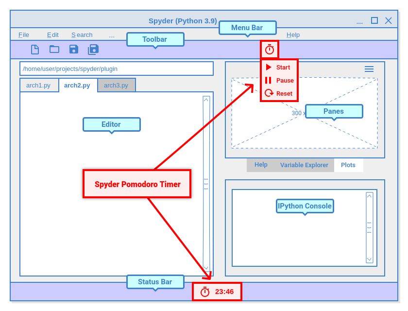

   Figure 1: Location of Spyder Pomodoro Timer widgets in Spyder.

.. _tutorial-figure-2:

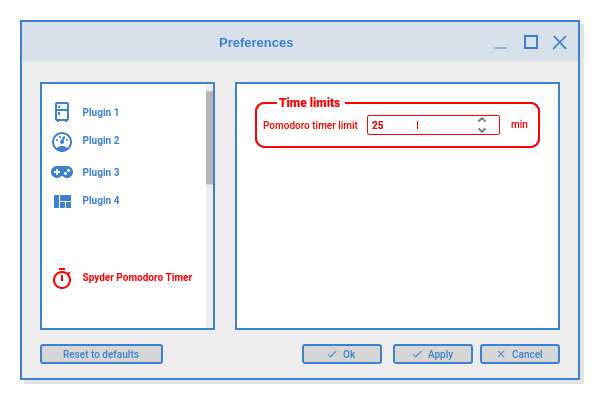

   Figure 2: Spyder Pomodoro Timer in the preferences window.

.. _tutorial-feature-explanation:

* Pomodoro Timer

  - *Status bar widget*.
    Used to display the time of the current pomodoro interval.
  - *State*.
    We have three activity states: ``pomodoro``, ``short-break`` and ``long-break``.
    We can show a message (with `QMessageBox`_) to indicate to users that it is time to take a break.
  - *Interactions*.
    The user can use :guilabel:`Start`, :guilabel:`Stop` and :guilabel:`Reset` buttons to operate the pomodoro timer.
    This could be implemented by adding instances of `QAction`_ in a toolbar menu.
  - *Preferences*.
    An option will be implemented in the preferences window to set the time limits of the pomodoro timer.

* Tasks Logger

  - *Counter*.
    A variable is needed to count the number of completed pomodoros.

* Notifications

  - *Dialog*.
    Each time a pomodoro or break interval is completed, a message should appear to tell the user to start working on a task or take a break.

.. _QTimer: https://doc.qt.io/archives/qtforpython-5.12/PySide2/QtCore/QTimer.html
.. _QToolButton: https://doc.qt.io/archives/qtforpython-5.12/PySide2/QtWidgets/QToolButton.html
.. _QAction: https://doc.qt.io/archives/qtforpython-5.12/PySide2/QtWidgets/QAction.html
.. _QLabel: https://doc.qt.io/archives/qtforpython-5.12/PySide2/QtWidgets/QLabel.html
.. _QLineEdit: https://doc.qt.io/archives/qtforpython-5.12/PySide2/QtWidgets/QLineEdit.html
.. _QMessageBox: https://doc.qt.io/archives/qtforpython-5.12/PySide2/QtWidgets/QMessageBox.html

.. _tutorial-setup:

=======================
Development environment
=======================

This section describes two main tasks for plugin development: :ref:`tutorial-environment` and :ref:`tutorial-repo` to manage code changes and versions.

.. _tutorial-environment:

Setting up the development environment
~~~~~~~~~~~~~~~~~~~~~~~~~~~~~~~~~~~~~~

In principle, we could use any copy of Spyder within a `conda environment`_ installed as described in the :ref:`spyder:install-guide`.
However, if you use a working environment that has other dependencies and you want to keep your plugin development independent of them, we recommend creating a new virtual environment that only has Spyder with the minimum dependencies needed for your plugin.

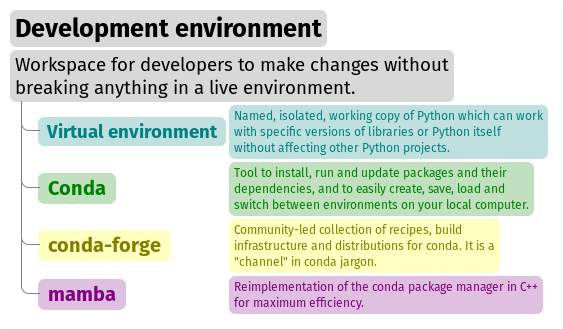

We can install it using the following system terminal commands (in the Anaconda Prompt, on Windows):

.. code-block:: shell

   conda activate base
   conda create -n spyder-dev -c conda-forge spyder
   conda activate spyder-dev

.. note::

   * `Miniforge`_ is a Python distribution for data science and machine learning, similar to Anaconda except without all the glut of packages installed by default (which won't be used here).
   * `Conda`_ is an open source tool that manages virtual environments and their packages.
   * Conda can work with *channels* that allow the use of packages that are not part of the official distribution.
     The most important channel is `conda-forge`_, where a more extensive and updated list of packages is maintained than those offered by Anaconda itself.

.. _conda environment: https://conda.io/projects/conda/en/latest/user-guide/concepts/environments.html
.. _Miniforge: https://conda-forge.org/download/
.. _Conda: https://docs.conda.io/en/latest/
.. _conda-forge: https://conda-forge.org/

.. _tutorial-repo:

Creating a repository
~~~~~~~~~~~~~~~~~~~~~~

Now that we have our local virtual environment, it is good practice to manage our source code with a version control system.
By far the most widely used VCS is `Git`_, and the most popular web hosting service for Git is `GitHub`_.
You can find the `Spyder repository`_ on GitHub, and download (or ``clone``) it with Git.

.. _Git: https://git-scm.com
.. _GitHub: https://github.com
.. _Spyder repository: https://github.com/spyder-ide/spyder

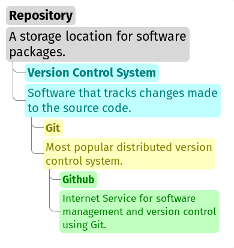

To create a Git repository on GitHub, we need to follow these steps:

#. Log in to your GitHub account (or create one if you don't have one already).

#. Click on the :guilabel:`New repository` option in the :guilabel:`+` menu at the top right next to your profile picture.

#. Type the repository name in the resulting dialog and select the options you want (e.g. whether to initialize the repository with a README or license files).

#. Click the :guilabel:`Create repository` button.

#. In the main window of the newly created repository, click on the green :guilabel:`Code` button and copy the clone link.

#. On your local command line, run ``git clone <repo-link>``.
   You must have Git installed and configured on your computer.
   If you have no experience using Git, we recommend The Carpentries workshop `Version Control with Git`_.

You can find a detailed description of `creating repositories`_ in the official GitHub documentation, and a `Hello World tutorial`_ with basic Git operations from the GitHub interface.

.. _Version Control with Git: https://swcarpentry.github.io/git-novice/
.. _creating repositories: https://docs.github.com/en/repositories/creating-and-managing-repositories/quickstart-for-repositories
.. _Hello World tutorial: https://docs.github.com/en/get-started/start-your-journey/hello-world

.. _tutorial-plugin-structure:

=============================
Defining the plugin structure
=============================

We already have :ref:`a Git repository <tutorial-repo>` and :ref:`a virtual environment <tutorial-environment>` where Spyder 5 is installed.
Let's activate our environment in the system terminal (Anaconda Prompt for Windows) and navigate into the root folder of our repository:

.. code-block:: shell

   conda activate spyder-dev
   cd path/to/your/repository

.. _tutorial-cookiecutter:

Then we need to use `Cookiecutter`_ to create the :ref:`initial structure <tutorial-structure-details>` of our plugin.
Cookiecutter is a tool implemented in Python specifically designed to create project skeletons.
We have developed a `Spyder Cookiecutter template`_ to generate the basic structure of a plugin.

.. _Cookiecutter: https://cookiecutter.readthedocs.io

.. _Spyder Cookiecutter template: https://github.com/spyder-ide/spyder5-plugin-cookiecutter

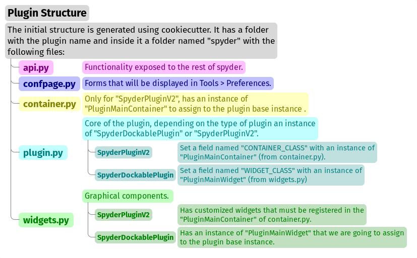

Let's run Cookiecutter to generate our plugin structure:

.. code-block:: console

   $ cookiecutter https://github.com/spyder-ide/spyder5-plugin-cookiecutter
   You\'ve downloaded /home/mapologo/.cookiecutters/spyder5-plugin-cookiecutter before.
   Is it okay to delete and re-download it? [yes]:
   full_name [Spyder Bot]: Francisco Palm # It's your name, better John Doe
   email [spyder.python@gmail.com]: fpalm@qu4nt.com
   github_username [spyder-bot]: map0logo
   github_org [spyder-ide]:
   project_name [Spyder Boilerplate]: Spyder Pomodoro Timer
   project_short_description [Boilerplate needed to create a Spyder Plugin.]: A very simple pomodoro timer that shows in the status bar.
   project_pypi_name [spyder-pomodoro-timer]:
   project_package_name [spyder_pomodoro_timer]:
   pypi_username [map0logo]:
   Select plugin_type:
   1 - Spyder Dockable Plugin
   2 - Spyder Plugin
   Choose from 1, 2 [1]: 2
   Select open_source_license:
   1 - MIT license
   2 - BSD license
   3 - ISC license
   4 - Apache Software License 2.0
   5 - GNU General Public License v3
   6 - Not open source
   Choose from 1, 2, 3, 4, 5, 6 [1]: 1

.. _tutorial-structure-details:

After ``cookicutter`` finishes its job, you'll get the following tree structure in your repository:

.. code-block:: text

   .
   ├── [Some info files]
   ├── Makefile
   ├── setup.py
   ├── spyder_pomodoro_timer
   │   ├── __init__.py
   │   └── spyder
   │       ├── __init__.py
   │       ├── api.py
   │       ├── confpage.py
   │       ├── container.py
   │       ├── locale
   │       │   └── spyder_pomodoro_timer.pot
   │       ├── plugin.py
   │       └── widgets.py
   └── tests

In the root folder you'll find two important files:

* The Makefile, which has several useful commands:

  .. code-block:: text

     clean                remove all build, test, coverage and Python artifacts
     clean-build          remove build artifacts
     clean-pyc            remove Python file artifacts
     clean-test           remove test and coverage artifacts
     test                 run tests quickly with the default Python
     docs                 generate Sphinx HTML documentation, including API docs
     servedocs            compile the docs watching for changes
     release              package and upload a release
     dist                 builds source and wheel package
     install              install the package to the active Python's site-packages
     develop              install the package to the active Python's site-packages

* ``setup.py``.
  It helps you install, package and distribute your plugin with Setuptools, the standard for distributing Python packages.
  In this file the ``entry_points`` parameter of ``setup`` is quite important, as it is what allows Spyder to identify this package as a plugin, and know how to access its functionality.

The folder for ``spyder-pomodoro-timer`` has the project name you entered when you ran ``cookiecutter``.
Inside it we should see a folder called ``spyder``, where we will place the code of our plugin.

In the ``spyder`` directory you'll find the following files:

* ``api.py``.
  Exposes the functionality of the plugin to the rest of Spyder, allowing other plugins to build on top of it in turn.

* ``plugin.py``.
  This is the core of the plugin.
  Depending on the type of plugin created, you will see an instance of either ``SpyderDockablePlugin`` or ``SpyderPluginV2``.

  * If it is a ``SpyderPluginV2``, it needs to have a constant named ``CONTAINER_CLASS`` with its value being a class object which is a subclass of ``PluginMainContainer``.
  * If it is a ``SpyderDockablePlugin``, it needs constant named ``WIDGET_CLASS`` with its value being a class object which is a subclass of ``PluginMainWidget``.

  For example, with a ``SpyderPluginV2``:

  .. code-block:: python

     # plugin.py
     from spyder.api.plugins import SpyderPluginV2
     from my_plugin.spyder.container import MyContainer

     class MyPlugin(SpyderPluginV2):
         CONTAINER_CLASS = MyContainer

* ``container.py``.
  Only used for ``SpyderPluginV2`` plugins, this file has an instance of ``PluginMainContainer`` that contains references to all graphical elements (or widgets) your plugin will add to the interface.
  This is necessary because Qt requires widgets to be children of other widgets before using them (otherwise they appear as floating windows).
  Since ``SpyderPluginV2`` is not a widget, the container (which is a widget) serves this role for us.

* ``widgets.py``.
  Contains the graphical components of our plugin.
  This not needed for a ``SpyderPluginV2`` without widgets.
  For ``SpyderPluginV2`` with widgets or a ``SpyderDockablePlugin``, the required instance of ``PluginMainWidget`` goes here.

* ``confpage.py``.
  Includes the configuration page that will be displayed in :guilabel:`Preferences`, so that the user can adjust the options of our plugin.

.. _tutorial-building-plugin:

===================
Building our plugin
===================

We'll now build the three components of our plugin step by step: its :ref:`graphical widgets <tutorial-building-widgets-py>`, the :ref:`container for them <tutorial-building-container-py>`, and the :ref:`plugin interface itself <tutorial-building-plugin-py>`.

The `Spyder-Pomodoro-Timer repository`_ contains all the major versions of the code we'll walk you through, in case you run into any issues.
We'll call the initial template (produced by :ref:`the cookiecutter above <tutorial-plugin-structure>`) *INITIAL*.
The first working version we are building here we'll refer to as ``HELLO WORLD``.

.. note::

   We will include links to the GitHub diffs between the tags at the end of each subsection, as an aid to check the progressive changes that we'll make in the code.

.. _Spyder-Pomodoro-Timer repository: https://github.com/map0logo/spyder-pomodoro-timer
.. _INITIAL: https://github.com/map0logo/spyder-pomodoro-timer/tree/v0.1.1-dev0

.. _tutorial-building-widgets-py:

The widgets
~~~~~~~~~~~

The best way to start building our plugin is to implement its graphical components in the ``widgets.py`` file.

In `INITIAL`_, the ``widgets.py`` file contains:

.. code-block:: python

   # Spyder imports
   from spyder.api.config.decorators import on_conf_change
   from spyder.api.translations import get_translation
   from spyder.api.widgets.mixins import SpyderWidgetMixin

   # Localization
   _ = get_translation("spyder_pomodoro_timer.spyder")

The predetermined imports are a guide to what we will need in our plugin:

* ``@on_conf_change`` (a decorator) propagates configuration changes.
* ``get_translation()`` generates and retrieves translation strings for the plugin.
* ``SpyderWidgetMixin`` adds the necessary attributes and methods to widgets to integrate it with Spyder (e.g. icon, style, translation, actions, and extra options).

Taking a look at the ``spyder.api.widgets.status`` module, there are two types of predefined widgets to go in the Spyder status bar:

* ``StatusBarWidget``.
  A class derived from ``QWidget`` and ``SpyderWidgetMixin``, which contains an icon, a label, and a spinner (to show the plugin loading).
* ``BaseTimerStatus``.
  A class derived from ``StatusBarWidget`` with an internal ``QTimer`` to periodically update its content.

Since we want a widget that shows the Pomodoro countdown and is updated periodically, we will use an instance of ``BaseTimerStatus``.
So, we can replace

.. code-block:: python

   from spyder.api.widgets.mixins import SpyderWidgetMixin

with

.. code-block:: python

   from spyder.api.widgets.status import BaseTimerStatus
   from spyder.utils.icon_manager import ima

and add an initial import:

.. code-block:: python

   # Third party imports
   import qtawesome as qta

With that, we can write our first widget like this:

.. code-block:: python

   class PomodoroTimerStatus(BaseTimerStatus):
       """Status bar widget to display the pomodoro timer."""

       ID = "pomodoro_timer_status"
       CONF_SECTION = "spyder_pomodoro_timer"

       def __init__(self, parent):
           super().__init__(parent)
           self.value = "25:00"

       def get_tooltip(self):
           """Override api method."""
           return "I am the Pomodoro timer!"

       def get_icon(self):
           return qta.icon("mdi.av-timer", color=ima.MAIN_FG_COLOR)

.. note::

    Spyder needs an ``ID`` to be defined for ``BaseTimerStatus``.
    Its constructor calls the parent class constructor and initializes the label with ``value``.

We've added a tooltip to explain the purpose of our widget, and an icon from `QtAwesome`_ (a Spyder project that makes it easy to incorporate icon fonts into PyQT applications).
We can find an appropriate icon by running the ``qta-browser`` command in a system terminal (Anaconda Prompt on Windows).

From here, as :ref:`Figure 3 <tutorial-figure-3>` shows, we can select and copy the icon name of our preference.

.. _tutorial-figure-3:

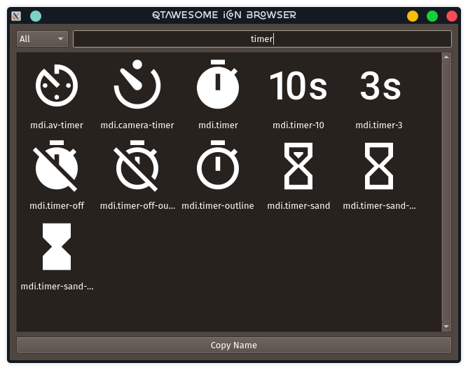

   Figure 3: QtAwesome icon browser

To finish the implementation of our widget, ``BaseTimerStatus`` requires the following method to update its contents each time it is requested by the internal timer:

.. code-block:: python

   # ---- BaseTimerStatus API
   def get_value(self):
       """Get current time of the timer."""
       return self.value

Here's the `INITIAL -> HELLO WORLD widgets.py diff <https://github.com/map0logo/spyder-pomodoro-timer/commit/c7b5cc6c4ce3c4afcd3cb9d3474bdabe2b81e060>`__ that sums everything up.

.. _QtAwesome: https://github.com/spyder-ide/qtawesome

.. _tutorial-building-container-py:

The container
~~~~~~~~~~~~~

The next step is instantiating the status bar widget we :ref:`created above <tutorial-building-widgets-py>`.
To do this, we need a ``QWidget`` instance (the container) to be the parent of all the other widgets in our plugin (as explained in the :ref:`discussion above <tutorial-structure-details>`).

The ``INITIAL`` version of the ``container.py`` file is:

.. code-block:: python

   from spyder.api.config.decorators import on_conf_change
   from spyder.api.translations import get_translation
   from spyder.api.widgets.main_container import PluginMainContainer

   _ = get_translation("spyder_pomodoro_timer.spyder")

   class SpyderPomodoroTimerContainer(PluginMainContainer):

       # Signals

       # --- PluginMainContainer API
       # ------------------------------------------------------------------------
       def setup(self):
           pass

       def update_actions(self):
           pass

``SpyderPomodoroTimerContainer`` is already defined, and we just need to implement the ``setup()`` method.
This is where we add the widget we :ref:`created earlier <tutorial-building-widgets-py>` to the container.

To do so, first we need to import the widget:

.. code-block:: python

   # Local imports
   from spyder_pomodoro_timer.spyder.widgets import PomodoroTimerStatus

Then, we edit the ``setup()`` method to add an instance of our widget.

.. code-block:: python

       def setup(self):
           # Widgets
           self.pomodoro_timer_status = PomodoroTimerStatus(self)

Here's the full `INITIAL -> HELLO WORLD container.py diff <https://github.com/map0logo/spyder-pomodoro-timer/commit/73dbc2c010274613357d6d8d2e4d1428dc030c77>`__, as a review.

.. _tutorial-building-plugin-py:

The plugin
~~~~~~~~~~

Finally, we define our plugin to be registered within Spyder.
The `INITIAL`_ version (i.e. the one created by :ref:`our cookiecutter template <tutorial-plugin-structure>`) of the ``plugin.py`` file has a number of imports:

.. code-block:: python

    # Third-party imports
    from qtpy.QtGui import QIcon

    # Spyder imports
    from spyder.api.plugins import Plugins, SpyderPluginV2
    from spyder.api.translations import get_translation

    # Local imports
    from spyder_pomodoro_timer.spyder.confpage import SpyderPomodoroTimerConfigPage
    from spyder_pomodoro_timer.spyder.container import SpyderPomodoroTimerContainer

    _ = get_translation("spyder_pomodoro_timer.spyder")

and the main plugin class:

.. code-block:: python

    class SpyderPomodoroTimer(SpyderPluginV2):
        """Spyder Pomodoro Timer plugin."""

        NAME = "spyder_pomodoro_timer"
        REQUIRES = []
        OPTIONAL = []
        CONTAINER_CLASS = SpyderPomodoroTimerContainer
        CONF_SECTION = NAME
        CONF_WIDGET_CLASS = SpyderPomodoroTimerConfigPage

        # --- Signals

        # --- SpyderPluginV2 API
        # ------------------------------------------------------------------------
        def get_name(self):
            return _("Spyder Pomodoro Timer")

        def get_description(self):
            return _("A very simple Pomodoro timer")

        def get_icon(self):
            return QIcon()

        def on_initialize(self):
            container = self.get_container()
            print('SpyderPomodoroTimer initialized!')

        def check_compatibility(self):
            valid = True
            message = ""  # Note: Remember to use _("") to localize the string
            return valid, message

        def on_close(self, cancellable=True):
            return True

.. note::

   The ``CONTAINER_CLASS`` constant is what registers the container class we :ref:`implemented previously <tutorial-building-container-py>` with the top-level plugin object.

Now, we need to declare the dependencies of our plugin by defining the ``REQUIRES`` class constant.
As we are going to add a status bar widget, we need the ``StatusBar`` plugin, as shown below.

.. code-block:: python

       REQUIRES = [Plugins.StatusBar]

Then, we need to set the icon for our plugin.
For that, we replace

.. code-block:: python

   from qtpy.QtGui import QIcon

with

.. code-block:: python

   # Third-party imports
   import qtawesome as qta

   # Spyder imports
   from spyder.utils.icon_manager import ima

and replace

.. code-block:: python

       def get_icon(self):
           return QIcon()

with

.. code-block:: python

       def get_icon(self):
           return qta.icon("mdi.av-timer", color=ima.MAIN_FG_COLOR)

We also need to add, under Spyder imports:

.. code-block:: python

   # Spyder imports
   from spyder.api.plugin_registration.decorators import on_plugin_available

And add the following code after the ``on_initialize()`` method:

.. code-block:: python

       @on_plugin_available(plugin=Plugins.StatusBar)
       def on_statusbar_available(self):
           statusbar = self.get_plugin(Plugins.StatusBar)
           if statusbar:
               statusbar.add_status_widget(self.pomodoro_timer_status)

Taking these changes into account, Spyder will recognize the presence of our plugin and identify that it adds a new widget to the status bar.

Finally, we add the following ``property`` accessor to our plugin class:

.. code-block:: python

   @property
   def pomodoro_timer_status(self):
       container = self.get_container()
       return container.pomodoro_timer_status

This way, consumers of ``SpyderPomodoroTimer`` can easily read (but not write) ``pomodoro_timer_status`` as an attribute of the top-level plugin.

In summary, we implemented the following structure:

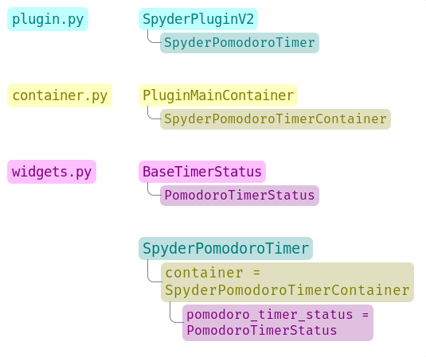

We :ref:`created a widget <tutorial-building-widgets-py>`, :ref:`added it to a container <tutorial-building-container-py>`.
In the plugin, we accessed the instance of that widget and added it to the status bar.

To summarize, here's the full diff, `INITIAL -> HELLO WORLD plugin.py diff <https://github.com/map0logo/spyder-pomodoro-timer/commit/d368e695e096e1a054e043671f98b5f0021b6822>`__.

.. _tutorial-testing-plugin:

==================
Testing our plugin
==================

Now it is time to see how our plugin looks in the Spyder interface.

In a system terminal (Anaconda Prompt on Windows), **from the root folder of our plugin**, we activate the plugin's environment and install it:

.. code-block:: shell

   conda activate spyder-dev
   pip install -e .

Running Spyder in the system terminal and checking the output, we should see:

.. code-block:: console

   $ spyder
   SpyderPomodoroTimer registered!

And as :ref:`Figure 4 <tutorial-figure-4>` presents, you should see our plugin in the Spyder status bar with the tooltip :guilabel:`I am the Pomodoro tooltip`!

.. _tutorial-figure-4:

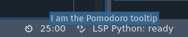

   Figure 4: First "Hello World" version of our plugin in the status bar

.. hint::
   Every time we modify the code, we'll need to restart Spyder to see the updates to our plugin.

.. _tutorial-update-timer:

==============================
Making the Pomodoro timer work
==============================

Now, we're going to get into the details of how Spyder plugins are implemented in Qt.
The plugin displays the time in Spyder's status bar, but the Pomodoro timer is not being updated.
In this section, we will use a ``QTimer`` in the ``PomodoroTimerStatus`` class (inherited from ``BaseTimerStatus``) to update the time shown in the status bar.

.. hint::

   If you're new to `Qt`_, see our :ref:`qt-fundamentals` page for an overview of the basics, and the  `Qt documentation`_ for the full reference.

.. _Qt documentation: https://doc.qt.io/

Let's go back to ``widgets.py`` and add the default time and update interval below the import lines:

.. code-block:: python

   # --- Constants

   # ------ Default time limits
   POMODORO_DEFAULT = 25 * 60 * 1000  # 25 minutes in milliseconds
   INTERVAL = 1000

``POMODORO_DEFAULT`` sets the default Pomodoro time limit in milliseconds and ``INTERVAL`` is how often to update the timer (every second).

Now, in the ``__init__`` method of the ``PomodoroTimerStatus`` class, we need to add:

.. code-block:: python

       # Current time limit
       self.pomodoro_limit = POMODORO_DEFAULT
       self.countdown = self.pomodoro_limit
       self._interval = INTERVAL

       self.timer.timeout.connect(self.update_timer)
       self.timer.start(self._interval)

Here, we add the following attributes:

* ``pomodoro_limit``: The current Pomodoro time limit in ms, which we set to the default time specified by the ``POMODORO_DEFAULT`` constant.
* ``countdown``: The number of milliseconds left in the countdown, which is set to the starting value of ``self.pomodoro_limit``.
* ``_interval``: The timer update frequency, to which we assign the value of the ``INTERVAL`` constant (1000 ms / 1 s).

.. note:: The leading underscore (``_``) in ``self._interval``, signifies this attribute is private and not intended to be used outside the class.

After that, we set up the ``self.timer`` object, a ``QTimer`` which this class inherits from its parent ``BaseTimerStatus``.
To do this, we use the ``connect`` method of ``self.timer.timeout``, passing it a ``update_timer`` function as a callback.
Then, we call ``self.timer.start()``, which calls ``update_timer`` at the time interval we pass it.

Now let's implement the ``update_timer()`` callback method (at the end of ``widgets.py``):

.. code-block:: python

       def display_time(self):
           """Calculate the time that should be displayed."""
           minutes = int((self.countdown / (1000 * 60)) % 60)
           seconds = int((self.countdown / 1000) % 60)
           return f"{minutes:02d}:{seconds:02d}"

       def update_timer(self):
           """
           Update the timer and the current widget.
           Also update the task counter if a task is a set.
           """
           if self.countdown > 0:
               # Update the current timer by decreasing the current running time by one second
               self.countdown -= INTERVAL
               self.value = self.display_time()

The ``display_time()`` method converts the current ``countdown`` value into human-readable text, which the ``update_timer()`` callback uses to decrement the timer value every second until it reaches zero.

If we run Spyder again, we will see that our timer has started counting down.

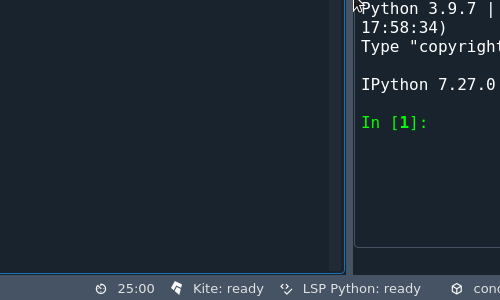

For reference, the changes in this revision ("``TIMER``") are shown in the `HELLO WORLD -> TIMER widgets.py diff <https://github.com/map0logo/spyder-pomodoro-timer/commit/5d72eaf2c8ce6c7760529c90121837e275757974>`__.

.. _tutorial-toolbar:

====================================
Adding timer controls to the toolbar
====================================

Now that our plugin :ref:`updates the timer <tutorial-update-timer>` in Spyder's toolbar, we'll add some controls for it, by:

#. :ref:`tutorial-toolbar-subclass`,
#. :ref:`tutorial-toolbar-actions`,
#. :ref:`tutorial-toolbar-behavior`,
#. :ref:`tutorial-toolbar-registration`, and
#. :ref:`tutorial-toolbar-reviewing`.

Implementing these changes will help us learn how to work with toolbars, menus, and actions in Spyder.
For future reference, we'll call this revision ``TOOLBAR``.

.. _tutorial-toolbar-subclass:

Creating a toolbar subclass
~~~~~~~~~~~~~~~~~~~~~~~~~~~

Focusing on ``widgets.py`` first, let's import the Spyder ``ApplicationToolbar`` class:

.. code-block:: python

   from spyder.api.widgets.toolbars import ApplicationToolbar

Then, create our own subclass of it above the ``PomodoroTimerStatus`` class definition:

.. code-block:: python

   class PomodoroTimerToolbar(ApplicationToolbar):
       """Toolbar to add buttons to control our timer."""
       ID = 'pomodoro_timer_toolbar'

The only customization we need is to declare an ``ID`` to identify our particular toolbar.

Next, we need to declare a boolean variable in our status widget to indicate if the countdown is paused or not.
Let's add the following code inside the ``__init__`` method of the ``PomodoroTimerStatus`` class definition:

.. code-block:: python

   self.pause = True

And inside the ``update_timer`` method of the same class, replace

.. code-block:: python

           if self.countdown > 0:

with

.. code-block:: python

           if self.countdown > 0 and not self.pause:

Here's a full listing of the `TIMER -> TOOLBAR widgets.py diff <https://github.com/map0logo/spyder-pomodoro-timer/commit/48a946fdbb934b9b85facd3c1b77fc8999e049a9>`__.

.. _tutorial-toolbar-actions:

Declaring the high-level toolbar structure
~~~~~~~~~~~~~~~~~~~~~~~~~~~~~~~~~~~~~~~~~~

Now we'll declare the high-level structure of our new toolbar, including its actions and sections, as well as that of a menu for our plugin.
This goes in the ``api.py`` file, since that allows Spyder and other plugins to modify and add to our toolbar if needed.

.. note:: Actions represent the control buttons that have associated functions to be called when interacted with, while toolbar sections contain groups of actions.

Let's add the following to ``api.py``:

.. code-block:: python

   class PomodoroToolbarActions:
       Start = "start_timer"
       Pause = "pause_timer"
       Stop = "stop_timer'

   class PomodoroToolbarSections:
       Controls = "pomodoro_timer"

   class PomodoroMenuSections:
       Main = "main_section"

Here, we create three classes:

* ``PomodoroToolbarActions``: Lists the buttons in our toolbar—start, pause and stop the timer
* ``PomodoroToolbarSections``: Lists the sections of the graphical toolbar—in this case, just one for the timer controls
* ``PomodoroMenuSections``: Lists the sections of a menu for the plugin (again, just one in this case)

.. note::

   Lightweight class definitions with class constants facilitates the  exchange of this information with minimal complexity.

To review, you can check out the `TIMER -> TOOLBAR api.py diff <https://github.com/map0logo/spyder-pomodoro-timer/commit/cf540f972f37aaf5d6ccc8524cbcc7aeae9c483b>`__.

.. _tutorial-toolbar-behavior:

Implementing the toolbar behaviors
~~~~~~~~~~~~~~~~~~~~~~~~~~~~~~~~~~

Now let's implement the behavior of our new Pomodoro timer toolbar and its actions.
Because this involves the relationship between our plugin widgets, we'll do this in the ``container.py`` file.

:ref:`As we did <tutorial-building-widgets-py>` with the ``PomodoroTimerStatus`` class, we will use `QtAwesome`_ icons for our actions.
We also use the ``QToolButton`` class for the buttons added to our toolbar.
We'll first need to add these as third party imports (above the Spyder section):

.. code-block:: python

   # Third party imports
   import qtawesome as qta
   from qtpy.QtWidgets import QToolButton

At the end of the Spyder imports, we also need:

.. code-block:: python

   from spyder.utils.icon_manager import ima

We also need to add local imports from our ``widgets`` and ``api`` modules:

.. code-block:: python

   from spyder_pomodoro_timer.spyder.widgets import (
       PomodoroTimerStatus,
       PomodoroTimerToolbar,
   )
   from spyder_pomodoro_timer.spyder.api import (
       PomodoroToolbarActions,
       PomodoroToolbarSections,
       PomodoroMenuSections,
   )

Next, we need to modify the ``setup`` method of the ``SpyderPomodoroTimerContainer`` class.

First, let's instantiate the ``PomodoroTimerToolbar`` class that we declared previously:

.. code-block:: python

           title = _("Pomodoro Timer Toolbar")
           self.pomodoro_timer_toolbar = PomodoroTimerToolbar(self, title)

Second, we create the actions corresponding to start, pause, and stop buttons on our toolbar:

.. code-block:: python

           start_timer_action = self.create_action(
               PomodoroToolbarActions.Start,
               text=_("Start"),
               tip=_("Start timer"),
               icon=qta.icon("fa.play-circle", color=ima.MAIN_FG_COLOR),
               triggered=self.start_pomodoro_timer,
           )
           pause_timer_action = self.create_action(
               PomodoroToolbarActions.Pause,
               text=_("Pause"),
               tip=_("Pause timer"),
               icon=qta.icon("fa.pause-circle", color=ima.MAIN_FG_COLOR),
               triggered=self.pause_pomodoro_timer,
           )
           stop_timer_action = self.create_action(
               PomodoroToolbarActions.Stop,
               text=_("Stop"),
               tip=_("Stop timer"),
               icon=qta.icon("fa.stop-circle", color=ima.MAIN_FG_COLOR),
               triggered=self.stop_pomodoro_timer,
           )

We use the ``triggered`` parameter of ``create_action()`` to set the callback function that will be executed when the action is interacted with—in this case, when the corresponding toolbar buttons are clicked.

Third, we create a menu for our actions, and add them to it:

.. code-block:: python

           self.pomodoro_menu = self.create_menu(
               "pomodoro_timer_menu",
               text=_("Pomodoro timer"),
               icon=qta.icon("mdi.av-timer", color=ima.MAIN_FG_COLOR),
           )
           # Add actions to the menu
           for action in [start_timer_action, pause_timer_action, stop_timer_action]:
               self.add_item_to_menu(
                   action,
                   self.pomodoro_menu,
                   section=PomodoroMenuSections.Main,
               )

Fourth, let's create a button to pop up the menu immediately when clicked, setting ``PopupMode`` to ``QToolButton.InstantPopup`` to achieve this:

.. code-block:: python

           self.pomodoro_button = self.create_toolbutton(
               "pomodoro_timer_button",
               text=_("Pomodoro timer"),
               icon=qta.icon("mdi.av-timer", color=ima.MAIN_FG_COLOR),
           )
           self.pomodoro_button.setMenu(self.pomodoro_menu)
           self.pomodoro_button.setPopupMode(QToolButton.InstantPopup)

Fifth, we add the ``pomodoro_button`` menu popup to our toolbar:

.. code-block:: python

           self.add_item_to_toolbar(
               self.pomodoro_button,
               self.pomodoro_timer_toolbar,
               section=PomodoroToolbarSections.Controls,
           )

Finally, we insert the appropriate public methods at the end of the ``SpyderPomodoroTimerContainer`` declaration (in the ``# --- Public API`` section).

.. code-block:: python

           def start_pomodoro_timer(self):
               """Start the timer."""
               self.pomodoro_timer_status.timer.start(1000)
               self.pomodoro_timer_status.pause = False

           def pause_pomodoro_timer(self):
               """Pause the timer."""
               self.pomodoro_timer_status.timer.stop()
               self.pomodoro_timer_status.pause = True

           def stop_pomodoro_timer(self):
               """Stop the timer."""
               self.pomodoro_timer_status.timer.stop()
               self.pomodoro_timer_status.pause = True
               self.pomodoro_timer_status.countdown = self.pomodoro_timer_status.pomodoro_limit

These methods set the ``pause`` attribute of ``pomodoro_timer_status``,
and restart the countdown in the case of ``stop_pomodoro_timer()``.

Summing up, here's the `TIMER -> TOOLBAR container.py diff <https://github.com/map0logo/spyder-pomodoro-timer/commit/492f30771285af937a8a75d69e4e879d21f9dc0f>`__.

.. _tutorial-toolbar-registration:

Registering the toolbar
~~~~~~~~~~~~~~~~~~~~~~~

A final, mandatory step is to register the new ``pomodoro_timer_toolbar`` component in the ``plugin.py`` file.

To register, add ``Plugins.Toolbar`` to the plugin requirements:

.. code-block:: python

       REQUIRES = [Plugins.StatusBar, Plugins.Toolbar]

And use this plugin's API to add the Pomodoro toolbar we created in the ``container`` module to the Spyder toolbar area.

.. code-block:: python

       @on_plugin_available(plugin=Plugins.Toolbar)
       def on_toolbar_available(self):
           container = self.get_container()
           toolbar = self.get_plugin(Plugins.Toolbar)
           toolbar.add_application_toolbar(container.pomodoro_timer_toolbar)

Here's the final `TIMER -> ACTIONS plugin.py diff <https://github.com/map0logo/spyder-pomodoro-timer/commit/012c5ef6568114ea945501d44efb30afeefbad98>`__.

.. _tutorial-toolbar-reviewing:

Reviewing our changes
~~~~~~~~~~~~~~~~~~~~~

Once we've restarted Spyder, we should notice several new changes after our work above.

Our Pomodoro toolbar should be present, including its Start, Pause and Stop buttons.
In addition, the buttons should have the tooltips set by their corresponding ``tip`` parameter.

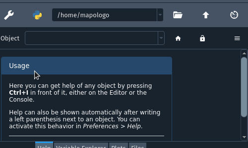

If we check the :menuselection:`View --> Toolbars` menu, there should be a new entry corresponding to our toolbar.

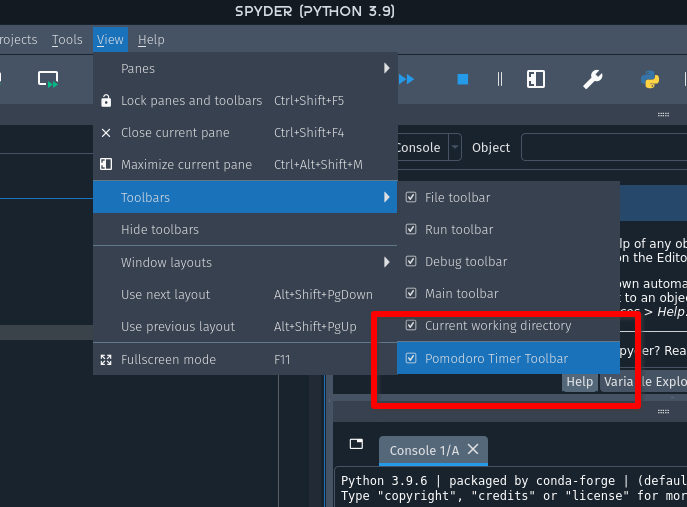

Finally, when we click the Pomodoro timer buttons on the toolbar, we should see the status bar widget changing accordingly.

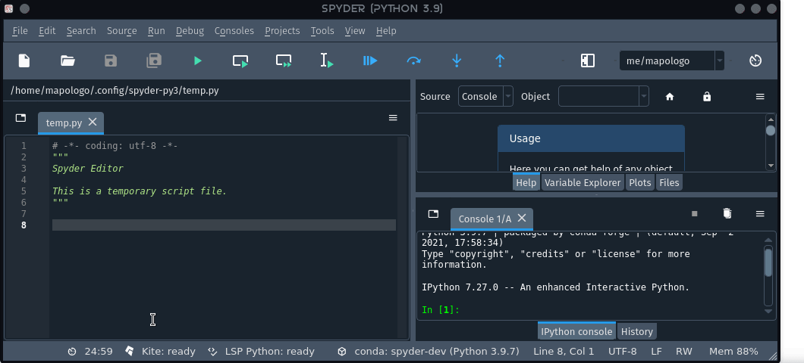

.. _tutorial-config:

===========================
Adding a configuration page
===========================

Spyder plugins can have their own preferences section with configurable options listed in Spyder's :guilabel:`Preferences` dialog.
In this section, we'll walk through implementing a preferences page for our example plugin.

We'll call this final version of our plugin ``CONFPAGE``, for reference in the diffs below.

_tutorial-config-defaults:

Defining the defaults
~~~~~~~~~~~~~~~~~~~~~

The first step is to define what options we want to offer our users, which we'll do in a new file named ``config.py``.
In this file we'll add some key constants and default config values:

.. code-block:: python

   """Spyder-Pomodoro-Timer default configuration."""

   # --- Constants

   # ------ Time limits by default
   POMODORO_DEFAULT = 25 * 60 * 1000  # 25 mins in milliseconds
   CONF_SECTION = "spyder_pomodoro_timer"
   CONF_DEFAULTS = [
       (
           CONF_SECTION,
           {
               "pomodoro_limit": POMODORO_DEFAULT / (60 * 1000),
           },
       ),
       ("shortcuts", {"pomodoro-timer start/pause": "Ctrl+Alt+Shift+P"}),
   ]

``CONF_SECTION`` is the internal name of our plugin's section in :guilabel:`Preferences`, as well as the plugin's namespace in the config dictionary.
``CONF_DEFAULTS`` lists the plugin's settings and their default values.
In the code, we are indicating that ``pomodoro_limit`` is a configurable parameter within the ``spyder_pomodoro_timer`` section, and storing its default value in minutes for user display.

At the end of this file, as shown below, we need to set the ``CONF_VERSION`` constant.
It must be incremented when adding, deleting, or renaming configurable parameters in successive versions of the plugin.

.. code-block:: python

   # IMPORTANT NOTES:
   # 1. If you want to *change* the default value of a current option, you need to
   #    do a MINOR update in config version, e.g. from 1.0.0 to 1.1.0
   # 2. If you want to *remove* options that are no longer needed in our codebase,
   #    or if you want to *rename* options, then you need to do a MAJOR update in
   #    version, e.g. from 1.0.0 to 2.0.0
   # 3. You don't need to touch this value if you're just adding a new option
   CONF_VERSION = "1.0.0"

.. note::
   We've also moved the definition of ``POMODORO_DEFAULT`` from ``widgets.py`` to ``config.py``, as we now have a dedicated place for default configuration values.

For reference, here's the `ACTIONS -> CONFPAGE config.py diff <https://github.com/map0logo/spyder-pomodoro-timer/commit/b71457c96013dc0b9c27d588f46568a81e9a2f0c>`__.

.. _tutorial-config-page:

Building the preferences page
~~~~~~~~~~~~~~~~~~~~~~~~~~~~~

Now, we need to create the preferences page itself.

To implement the required code, we will edit the generated ``confpage.py`` file as follows:

.. code-block:: python

   """Spyder Pomodoro Timer Preferences Page."""

   from qtpy.QtWidgets import QGridLayout, QGroupBox, QVBoxLayout
   from spyder.api.preferences import PluginConfigPage
   from spyder.api.translations import get_translation

   from spyder_pomodoro_timer.spyder.config import POMODORO_DEFAULT

   _ = get_translation("spyder_pomodoro_timer.spyder")

   class SpyderPomodoroTimerConfigPage(PluginConfigPage):

       # --- PluginConfigPage API
       def setup_page(self):
           limits_group = QGroupBox(_("Time limits"))
           pomodoro_spin = self.create_spinbox(
               _("Pomodoro timer limit"),
               _("min"),
               "pomodoro_limit",
               default=POMODORO_DEFAULT,
               min_=5,
               max_=100,
               step=1,
           )

           pt_limits_layout = QGridLayout()
           pt_limits_layout.addWidget(pomodoro_spin.plabel, 0, 0)
           pt_limits_layout.addWidget(pomodoro_spin.spinbox, 0, 1)
           pt_limits_layout.addWidget(pomodoro_spin.slabel, 0, 2)
           pt_limits_layout.setColumnStretch(1, 100)
           limits_group.setLayout(pt_limits_layout)

           vlayout = QVBoxLayout()
           vlayout.addWidget(limits_group)
           vlayout.addStretch(1)
           self.setLayout(vlayout)

Most of this code follows the typical pattern of building up a Qt widget-based user interface.
In this case, our options section uses a ``QGroupBox``, where the parameters are organized vertically using a ``QVBoxLayout``.
Each parameter corresponds to a ``QGridLayout`` where labels and inputs (in this case a ``QSpinBox``) are distributed.

.. tip::

   Configuration pages in Spyder provide some helper methods to facilitate this work.
   For instance, the ``create_spinbox()`` method allows us to instantiate and initialize the widgets corresponding to the prefix and suffix labels together with the spinbox, all in a single step.

You can see the all the changes we've made here in the `ACTIONS -> CONFPAGE confpage.py diff <https://github.com/map0logo/spyder-pomodoro-timer/commit/bd3bcf2ce895c440fb2d6b80233100c6d86822fe>`__.

.. _tutorial-config-changes:

Propagating config changes
~~~~~~~~~~~~~~~~~~~~~~~~~~

Since we moved all our configuration to ``config.py``, we now have to import it into ``widgets.py``:

.. code-block:: python

   # Local imports
   from spyder_pomodoro_timer.spyder.config import (
       CONF_SECTION,
       CONF_DEFAULTS,
       CONF_VERSION,
   )

In the class ``PomodoroTimerStatus``, after the ID declaration, let's add the config parameters as class constants:

.. code-block:: python

   CONF_SECTION = CONF_SECTION
   CONF_DEFAULTS = CONF_DEFAULTS
   CONF_VERSION = CONF_VERSION

We can now access the configuration options from anywhere in our plugin using the ``get_conf`` method.
In this case, we use this method to access the ``pomodoro_limit`` value of the configuration instead of just the ``POMODORO_DEFAULT`` constant, so we use the current user-selected value if configured:

.. code-block:: python

           self.pomodoro_limit = self.get_conf(
               "pomodoro_limit"
           )

Then, we can add the ``set_pomodoro_limit()`` method that updates our configurable parameter ``pomodoro_limit``.

.. code-block:: python

       @on_conf_change(option="pomodoro_limit")
       def set_pomodoro_limit(self, value):
           self.pomodoro_limit = int(value) * 1000 * 60
           self.countdown = self.pomodoro_limit
           self.value = self.display_time()

.. note:: The ``@on_conf_change`` decorator is responsible for capturing the signal generated when changing a specific config option.

To view all these changes together, see the `ACTIONS -> CONFPAGE widgets.py diff <https://github.com/map0logo/spyder-pomodoro-timer/commit/b94cee118bf887b52934230a35d67a0080551a68>`__.

.. _tutorial-config-registering:

Registering preferences
~~~~~~~~~~~~~~~~~~~~~~~

Finally, we need to enable using our new preference page in ``plugin.py``, by including ``Plugin.Preferences`` in the list of ``REQUIRES``:

.. code-block:: python

   class SpyderPomodoroTimer(SpyderPluginV2):
       ...
       REQUIRES = [Plugins.Preferences, Plugins.StatusBar, Plugins.Toolbar]

...and registering our plugin's preferences in the ``on_preferences_available()`` method, which is decorated with ``@on_plugin_available`` so it is called once the ``Preferences`` plugin is loaded:

.. code-block:: python

       @on_plugin_available(plugin=Plugins.Preferences)
       def on_preferences_available(self):
           preferences = self.get_plugin(Plugins.Preferences)
           preferences.register_plugin_preferences(self)

You can find the Spyder :guilabel:`Preferences` dialog in :menuselection:`Tools --> Preferences`, or :menuselection:`Python --> Preferences` on macOS.
As shown in the following image, we should find a section called :guilabel:`Spyder Pomodoro Timer`, which contains our :guilabel:`Pomodoro timer limit` parameter.
If we modify that value, we should see how the corresponding status bar timer updates appropriately.

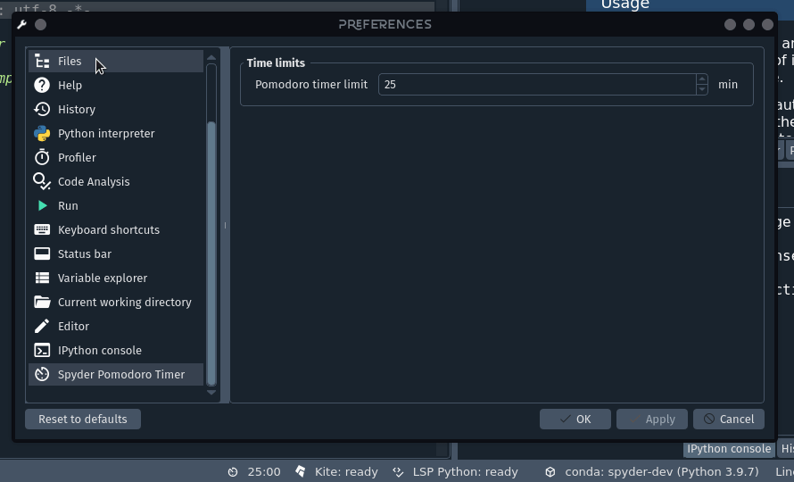

Now our example plugin is ready to be published!

For a review of our changes here, see the `ACTIONS -> CONFPAGE plugin.py diff <https://github.com/map0logo/spyder-pomodoro-timer/commit/b238b133d46a52e2d6e57ae938964094a45e7177>`__.

.. _tutorial-publishing:

=====================
Publishing our plugin
=====================

It's time to publish our plugin as a PyPI package!
`PyPI`_, the Python Package Index, is the central repository where anyone can publish their own Python packages, that can be installed with Pip or other similar tools.

.. _PyPI: https://pypi.org

.. note::

   Since the recommended way to install Spyder plugins is through `Conda-Forge`_, its a good idea to also publish our plugin there.
   Once our package is uploaded to PyPI, the `Grayskull`_ tool can automatically generate a Conda-Forge "recipe" with just a single command.
   This can be added to Conda-Forge by cloning the `Staged Recipes repo`_, adding the generated recipe to the ``recipes/`` directory, and submitting a PR with your changes.
   See the Conda-Forge `Contributing Packages`_ documentation for full details.

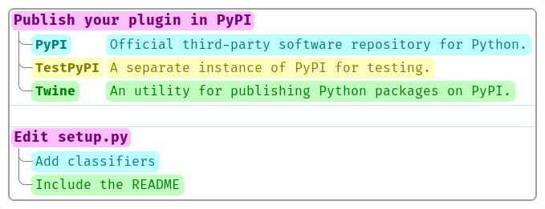

.. _Grayskull: https://github.com/conda/grayskull
.. _Staged Recipes repo: https://github.com/conda-forge/staged-recipes
.. _Contributing packages: https://conda-forge.org/docs/maintainer/adding_pkgs/

.. _tutorial-publishing-account:

Creating a PyPI account
~~~~~~~~~~~~~~~~~~~~~~~

First, we create an account on the `PyPI`_ and `TestPyPI`_ websites if we don't have one already, by clicking :guilabel:`Register` in the top left and entering the appropriate details.
Although our package will eventually be published on PyPI, it is advisable to use TestPyPI first to test that everything works correctly before actually uploading to the real thing, as once package versions are pushed to PyPI they cannot be changed.

Next, we should fill in the ``setup.py`` file at the root of our project with our package's metadata.

Finally, in order to build and upload our package to PyPI, we need the `Build`_ builder frontend and `Twine`_ uploader.
We can install them in our Conda environment using:

.. code-block:: shell

   conda install -c conda-forge python-build twine

.. caution::

   The Python ``build`` package is named ``build`` on PyPI (``pip install build``) and ``python-build`` on Conda-Forge (``conda install python-build``); the Conda-Forge package named ``build`` should *not* be used as it is obsolete.

.. _tutorial-publishing-building:

Building and checking the package
~~~~~~~~~~~~~~~~~~~~~~~~~~~~~~~~~

Before publishing our plugin, we must package it.
To do this, we execute the following code from the root folder of our project (where ``setup.py`` is located):

.. code-block:: shell

   python -m build

Then, we can see that the following files are generated in the new ``dist`` folder:

.. code-block:: text

   spyder_pomodoro_timer
   └── dist
       ├── spyder_pomodoro_timer-0.0.1.dev0-py3-none-any.whl
       └── spyder-pomodoro-timer-0.0.1.dev0.tar.gz

We can check that newly created distribution packages contain the expected files by inspecting the contents of the ``tar`` file (on Windows, you'll need a third-party tool like 7-Zip to open it):

.. code-block:: bash

   tar tzf dist/spyder-pomodoro-timer-0.0.1.dev0.tar.gz

You can also use Twine to run a check of the distribution packages created in the ``dist`` folder:

.. code-block:: console

   $ twine check dist/*
   Checking dist/spyder_pomodoro_timer-0.0.1.dev0-py3-none-any.whl: PASSED
   Checking dist/spyder-pomodoro-timer-0.0.1.dev0.tar.gz: PASSED

.. _tutorial-publishing-uploading:

Testing and uploading to PyPI
~~~~~~~~~~~~~~~~~~~~~~~~~~~~~

Now we can use ``twine`` to upload the distribution packages we have built.
First, we will upload them to TestPyPI to make sure everything works:

.. code-block:: shell

   twine upload --repository-url https://test.pypi.org/legacy/ dist/*

This command will prompt you for the user name and password with which you registered in TestPyPI.

To view the uploaded package, open the `Spyder-Pomodoro-Timer TestPyPI page <https://test.pypi.org/project/spyder-pomodoro-timer/>`_.
We should notice that some details are missing, such as the package description.
Also, our package is marked as ``Development Status 5-Stable``, which is not (yet) the case.

To fix the package description, we can follow the instructions in `Making a PyPI-friendly README`_.
Since we already have a ``README.md`` file, we simply add the following lines to the beginning of ``setup.py``:

.. code-block:: python

   # Read the contents of your README file
   from pathlib import Path
   this_directory = Path(__file__).parent
   long_description = (this_directory / "README.md").read_text()

   setup(
       name="spyder-pomodoro-timer",
       # ...
       long_description=long_description,
       long_description_content_type='text/markdown'
   )

We can also add or change the classifiers of our package using the `PyPI classifiers page <https://pypi.org/classifiers>`_ as a guide.
We can copy the classifiers we consider appropriate and paste them as a list into the ``classifiers`` argument of ``setup()``.

After these changes and bumping the version of our plugin in the ``__init__.py`` inside the ``spyder_pomodoro_timer`` folder, we can repeat the cycle of building a new version of our package with ``build`` and uploading it to TestPyPI with ``twine``.
After checking to make sure the result on TestPyPI looks as we expect, we can reset our package version to the initial ``0.1.0`` and finally upload it to PyPI with:

.. code-block:: shell

   twine upload dist/

We can check the result in at our `Spyder-Pomodoro-Timer PyPI page <https://pypi.org/project/spyder-pomodoro-timer/>`_.
Once this is done, anyone can install our plugin in their environments simply by running:

.. code-block:: shell

   pip install spyder-pomodoro-timer

.. _PyPI: https://pypi.org
.. _TestPyPI: https://test.pypi.org
.. _Setuptools: https://setuptools.pypa.io/
.. _Build: https://build.pypa.io/
.. _Twine: https://twine.readthedocs.io
.. _Making a PyPI-friendly README: https://packaging.python.org/guides/making-a-pypi-friendly-readme/

===========
Final words
===========

Through this tutorial, we have navigated many of the features that Spyder offers for developing plugins.
In Spyder, we have put a lot of effort toward creating and maintaining an API that allows for powerful, flexible and easy plugin development.
The main focus of the development effort between versions 4 and 5 was in this direction, while Spyder 6 further expanded upon this work, so we're looking forward to seeing what you can do with it!

In this tutorial, we've learned how to:

* Understand the basic building blocks of Spyder development.
* Choose the different types of plugins that can be implemented in Spyder.
* Plan the development of a new Spyder plugin.
* Set up a Spyder plugin development environment.
* Initialize a Git repository on GitHub to manage our version control.
* Generate the basic structure of a plugin using Cookiecutter.
* Understand the basic file structure of a Spyder plugin.
* Create, develop and test a plugin with Spyder.
* Add and register Qt widgets in both the Spyder status bar and the toolbar.
* Include a menu with multiple actions in the toolbar.
* Add configuration options to a plugin and make them appear in the :guilabel:`Preferences` dialog.
* Edit the packaging configuration of our plugin.
* Publish our plugin on TestPyPI and PyPI.

We hope these skills have helped you learn how to develop your very own Spyder plugins!

.. note::
   As you may have noticed, there were some features left to implement such as notifications when pomodoros are completed.
   Try to implement them by putting your knowledge in practice!
   Please, do not hesitate to contact us if you have any questions.

If you have any ideas for plugin development, you're welcome to contact us through the `Spyder-IDE`_ GitHub organization.

.. _Spyder-IDE: https://github.com/spyder-ide

===============
Further reading
===============

If you would like to dive deeper into Spyder plugin development, we invite you to consult the following resources:

* You can find additional examples in the `plugin-examples`_ repository that should be useful to better understand Spyder plugin development.
* A closer look at the `Spyder repository`_ itself, especially its simpler plugins (such as History, Plots or Working directory) can help you understand Spyder better.
* You can review the various helper functions, widgets and mixins present in `spyder.api`_.

.. _plugin-examples: https://github.com/spyder-ide/plugin-examples
.. _Spyder repository: https://github.com/spyder-ide/spyder
.. _spyder.api: https://github.com/spyder-ide/spyder/tree/master/spyder/api
